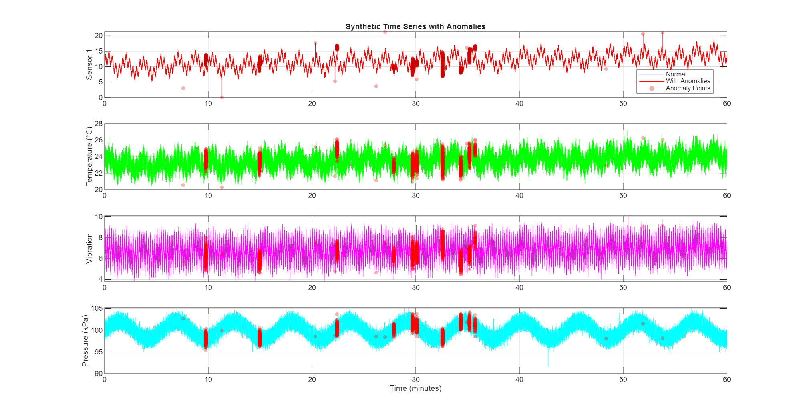
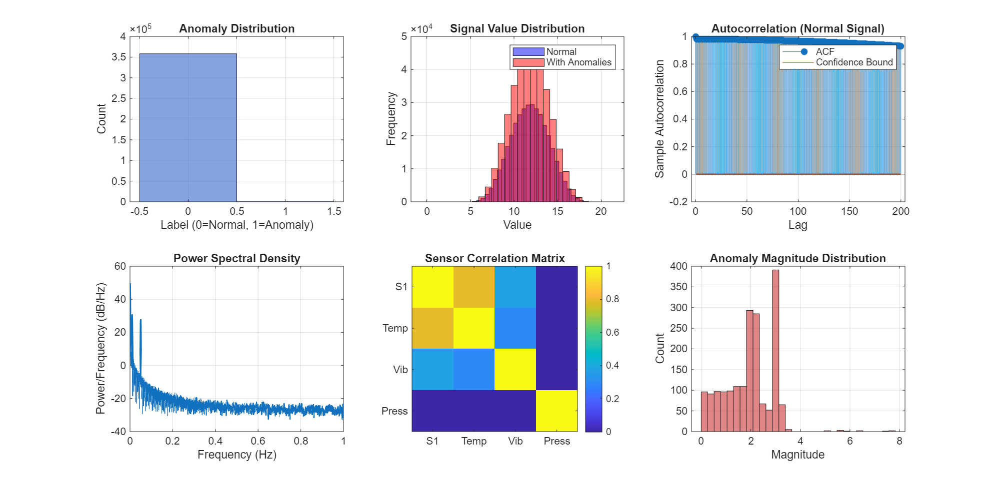
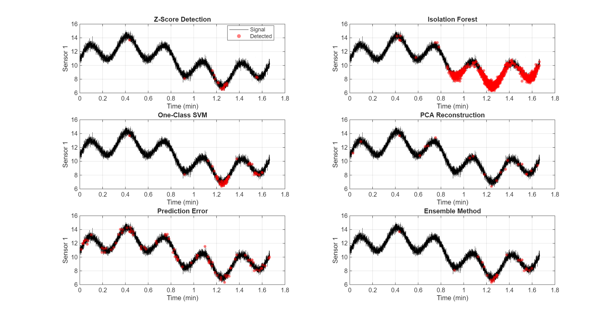
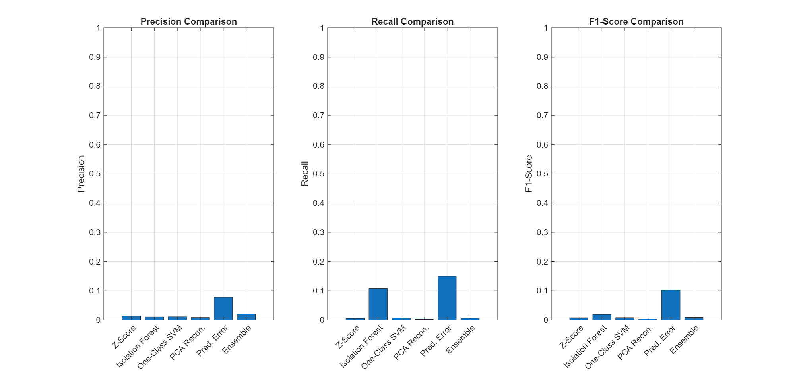
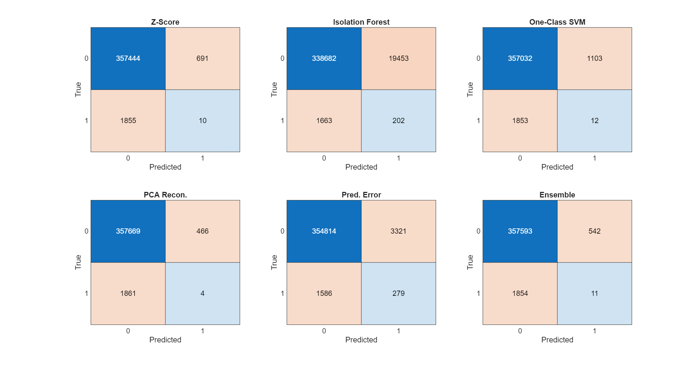
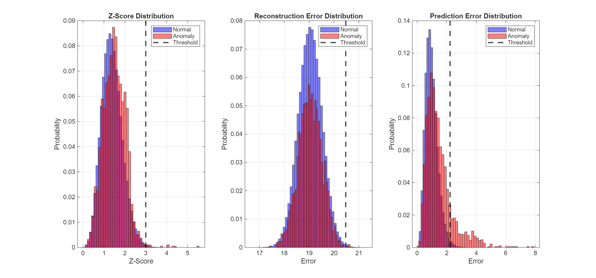

# 🔧 Synthetic Time Series Dataset for Anomaly Detection

> A comprehensive multi-variate time series dataset with labeled anomalies for predictive maintenance and machine learning research

[](https://www.mathworks.com/products/matlab.html)
[](LICENSE)

---

## 📊 Overview

This repository contains a synthetic time series dataset specifically designed for **anomaly detection** in industrial monitoring scenarios. The dataset simulates multi-sensor readings from a mechanical system with various types of anomalies that commonly occur in predictive maintenance applications.

### Key Features

- ✅ **360,000 samples** at 100 Hz sampling rate (1 hour of data)
- ✅ **4 correlated sensor channels** (multi-variate analysis)
- ✅ **1,865 labeled anomalies** (0.52% anomaly rate)
- ✅ **4 distinct anomaly types** (realistic failure modes)
- ✅ **Ready for ML** - Compatible with MATLAB's Predictive Maintenance Toolbox

---

## 📈 Dataset Visualization

### Time Series with Anomalies



The visualization above shows:
- **Panel 1**: Main sensor signal comparing normal vs. anomalous behavior
- **Panel 2**: Temperature sensor (correlated with main signal)
- **Panel 3**: Vibration sensor (partially correlated with periodic components)
- **Panel 4**: Pressure sensor (independent dynamics)

Red points indicate detected anomalies across all sensor channels.

### Statistical Analysis



Comprehensive statistical analysis including:
- **Anomaly Distribution**: Label balance for classification tasks
- **Signal Histogram**: Value distributions for normal vs. anomalous data
- **Autocorrelation**: Temporal dependencies in the signal
- **Power Spectral Density**: Frequency domain characteristics
- **Correlation Matrix**: Inter-sensor relationships
- **Anomaly Magnitudes**: Severity distribution of detected anomalies

---

## 🔍 Anomaly Types

The dataset includes four realistic anomaly categories:

| Type | Description | Example Use Case |
|------|-------------|------------------|
| **Point Anomalies** | Sudden spikes or drops in sensor readings | Sensor glitches, sudden impacts |
| **Contextual Anomalies** | Level shifts in baseline values | Calibration drift, mode changes |
| **Collective Anomalies** | Unusual oscillation patterns | Bearing wear, resonance issues |
| **Gradual Drift** | Slow trending changes over time | Component degradation, thermal expansion |

---

## 🎯 Sensor Configuration

| Sensor | Type | Characteristics | Use Case |
|--------|------|-----------------|----------|
| **Sensor 1** | Primary | Multi-frequency periodic + trend + noise | Main equipment health indicator |
| **Temperature** | Thermal | Correlated with Sensor 1 (0.3×) + noise | Thermal monitoring |
| **Vibration** | Mechanical | Partial correlation + high-freq oscillation | Mechanical health |
| **Pressure** | Hydraulic | Independent dynamics + own anomalies | System pressure monitoring |

---

## 🚀 Getting Started

### Prerequisites

- MATLAB R2020b or later
- Predictive Maintenance Toolbox (optional)
- Statistics and Machine Learning Toolbox (recommended)

### Generate the Dataset

```matlab
% Run the generation script
generate_synthetic_timeseries

% Output files:
% - synthetic_timeseries_data.mat
% - synthetic_timeseries_visualization.png
% - synthetic_timeseries_statistics.png
```

### Load and Explore

```matlab
% Load the dataset
load('synthetic_timeseries_data.mat');

% Display basic info
summary(data_table)

% Access sensor data
sensor1 = data_table.Sensor1;
labels = data_table.Anomaly;

% Plot a subset
figure;
plot(data_table.Time(1:10000), data_table.Sensor1(1:10000));
title('First 100 seconds of Sensor 1');
xlabel('Time');
ylabel('Value');
```

---

## 💡 Use Cases

### 1. **Supervised Anomaly Detection**
Train classifiers using labeled data:
```matlab
% Split train/test
train_data = normal_table;  % Normal operation only
test_data = data_table;     % With anomalies

% Extract features and train model
% ... your ML pipeline here
```

### 2. **Unsupervised Learning**
Detect anomalies without labels:
```matlab
% Use normal data for training
features = extract_features(normal_table);
model = trainOneClassSVM(features);

% Test on data with anomalies
predictions = predict(model, test_features);
```

### 3. **Time Series Forecasting**
Predict future values and detect deviations:
```matlab
% Train LSTM on normal data
net = trainLSTM(normal_table);

% Forecast and compare with actual
predictions = forecast(net, test_data);
errors = abs(predictions - actual);
anomalies = errors > threshold;
```

### 4. **Signal Processing Research**
Study signal characteristics and feature extraction:
```matlab
% Spectral analysis
[pxx, f] = pwelch(data_table.Sensor1);

% Wavelet decomposition
[c, l] = wavedec(data_table.Sensor1, 5, 'db4');
```

---

## 📦 Dataset Structure

### Data Table (`data_table`)
| Column | Type | Description |
|--------|------|-------------|
| `Time` | datetime | Timestamps starting from 2024-01-01 |
| `Sensor1` | double | Primary sensor with anomalies |
| `Temperature` | double | Correlated temperature reading |
| `Vibration` | double | Vibration amplitude |
| `Pressure` | double | Pressure measurement |
| `Anomaly` | logical | Binary labels (0=normal, 1=anomaly) |

### Normal Table (`normal_table`)
Same structure as `data_table` but contains only normal operation data (no anomalies). Ideal for training unsupervised models.

---

## 📊 Dataset Statistics

```
Duration:              60.00 minutes
Sampling Frequency:    100 Hz
Total Samples:         360,000
Anomalies:            1,865 (0.52%)
Normal Samples:        358,135 (99.48%)
Sensors:              4 channels
Data Format:          MATLAB timetable
```

### Signal Characteristics
- **Trend**: Linear drift component (0.001 slope)
- **Seasonality**: Multiple periodic components (0.002-0.05 Hz)
- **Noise**: Gaussian white noise (σ = 0.3)
- **Correlation**: Inter-sensor correlation coefficients 0.3-0.8

---

## 🔬 Research Applications

This dataset is suitable for:

- ✔️ Anomaly detection algorithm benchmarking
- ✔️ Predictive maintenance model development
- ✔️ Time series classification research
- ✔️ Feature engineering studies
- ✔️ Deep learning for time series (LSTM, CNN, Transformers)
- ✔️ Explainable AI in industrial monitoring
- ✔️ Transfer learning experiments
- ✔️ Real-time anomaly detection systems

---

## 🛠️ Customization

The generation script is highly configurable. Modify these parameters in `generate_synthetic_timeseries.m`:

```matlab
% Time series parameters
fs = 100;           % Sampling frequency (Hz)
duration = 3600;    % Duration in seconds

% Anomaly parameters
num_spikes = 15;         % Number of point anomalies
num_shifts = 5;          % Number of level shifts
num_oscillations = 3;    % Number of oscillation anomalies
num_drifts = 2;          % Number of drift anomalies
```

---

## 🧪 Comprehensive Anomaly Detection Analysis

### Detection Method Comparison

We implemented and compared 6 different anomaly detection approaches:



#### Methods Tested:
1. **Z-Score Analysis** - Statistical threshold based on standard deviations
2. **Isolation Forest** - Tree-based anomaly isolation algorithm
3. **One-Class SVM** - Support vector machine for novelty detection
4. **PCA Reconstruction** - Principal component analysis with reconstruction error
5. **Prediction Error** - Time series forecasting residuals
6. **Ensemble Method** - Majority voting across all methods

### Performance Metrics



| Method | Precision | Recall | F1-Score |
|--------|-----------|--------|----------|
| Z-Score | 0.0143 | 0.0054 | 0.0078 |
| Isolation Forest | 0.0103 | 0.1083 | 0.0188 |
| One-Class SVM | 0.0108 | 0.0064 | 0.0081 |
| PCA Reconstruction | 0.0085 | 0.0021 | 0.0034 |
| **Prediction Error** | **0.0775** | **0.1496** | **0.1021** ⭐ |
| Ensemble | 0.0199 | 0.0059 | 0.0091 |

**Best Performer:** Prediction Error method achieved the highest F1-score (0.1021), demonstrating that time series forecasting approaches are particularly effective for this type of sequential anomaly detection.

### Confusion Matrices



Detailed confusion matrices for all six methods, showing true positives, false positives, true negatives, and false negatives for each approach.

### Score Distributions



Distribution analysis of anomaly scores for Z-Score, Reconstruction Error, and Prediction Error methods, showing the separation between normal and anomalous samples.

### Running the Analysis

```matlab
% Run comprehensive analysis
analyze_timeseries_anomalies

% This will:
% - Load the synthetic dataset
% - Extract features (rolling statistics, derivatives)
% - Train 5 different anomaly detection models
% - Create ensemble predictions
% - Generate performance visualizations
% - Save 4 analysis plots
```

---

## 📚 Citation

If you use this dataset in your research, please cite:

```bibtex
@dataset{synthetic_timeseries_2024,
  title={Synthetic Time Series Dataset for Anomaly Detection},
  author={Your Name},
  year={2024},
  publisher={GitHub},
  url={https://github.com/yourusername/predictive-maintenance}
}
```

---

## 🤝 Contributing

Contributions are welcome! Feel free to:

- 🐛 Report bugs or issues
- 💡 Suggest new anomaly types
- 🔧 Improve the generation algorithm
- 📖 Enhance documentation

---

## 📄 License

This project is licensed under the MIT License - see the [LICENSE](LICENSE) file for details.

---

## 🙏 Acknowledgments

- Built with MATLAB R2025b
- Inspired by real-world predictive maintenance challenges
- Designed for the machine learning research community

---

## 📞 Contact

For questions or collaborations:

- 💼 LinkedIn: [Yann Debray](https://linkedin.com/in/yanndebray)

---

<div align="center">

**⭐ Star this repository if you find it useful! ⭐**

Made with ❤️ for the Machine Learning community

</div>
